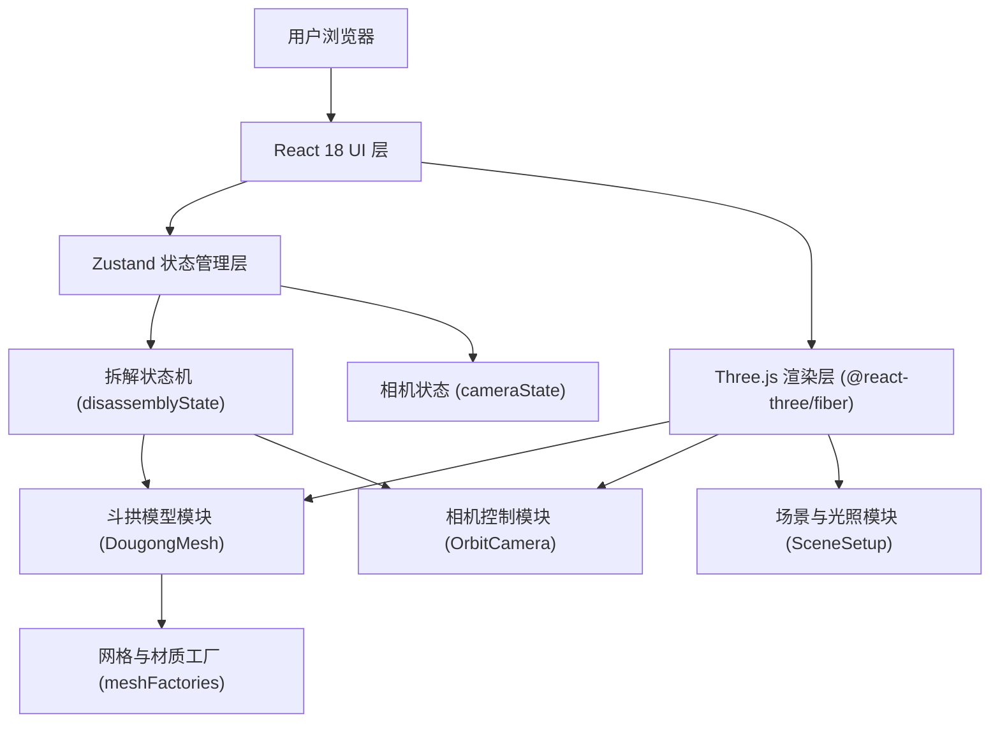

## 1. 架构设计



架构说明：
- **UI 层**：React 18 组件，负责步骤列表、说明面板、控制按钮
- **状态层**：Zustand 全局状态，管理拆解步骤与相机目标
- **3D 渲染层**：@react-three/fiber 封装 Three.js，响应式驱动场景
- **模块化分离**：网格材质、状态机、相机控制各自独立实现

## 2. 技术选型

- **前端框架**：React 18 + TypeScript
- **构建工具**：Vite 5
- **3D 渲染**：Three.js 0.160 + @react-three/fiber 8 + @react-three/drei 9
- **状态管理**：Zustand 4
- **样式方案**：Tailwind CSS 3
- **静态部署**：Nginx + Docker

## 3. 项目结构

```
src/
├── components/
│   ├── StepList.tsx          # 左侧步骤列表
│   ├── InfoPanel.tsx         # 右侧说明面板
│   └── ControlBar.tsx        # 底部控制栏
├── three/
│   ├── DougongMesh.tsx       # 斗拱模型主组件
│   ├── OrbitCamera.tsx       # 相机控制（含双击重置）
│   ├── SceneSetup.tsx        # 光照、网格地面
│   └── meshFactories.ts      # 网格与材质工厂函数
├── store/
│   └── useDisassemblyStore.ts # 拆解状态机（Zustand）
├── data/
│   └── steps.ts              # 步骤定义与中文文案
├── types/
│   └── index.ts              # 类型定义
├── App.tsx
├── main.tsx
└── index.css
```

## 4. 核心模块定义

### 4.1 拆解状态机 (useDisassemblyStore)

```typescript
// 当前步骤：0=完整, 1=拱已拆, 2=斗已拆, 3=枋已拆
type StepIndex = 0 | 1 | 2 | 3;

interface DisassemblyState {
  currentStep: StepIndex;
  totalSteps: 3;
  next: () => void;       // 下一步，边界保护
  prev: () => void;       // 上一步，边界保护
  goTo: (step: StepIndex) => void; // 跳转指定步骤
  isPartDetached: (partId: 'gong' | 'dou' | 'fang') => boolean;
}
```

拆解顺序映射：
- 步骤 0 → 全部装配
- 步骤 1 → 拱 (gong) 分离
- 步骤 2 → 拱 + 斗 (dou) 分离
- 步骤 3 → 拱 + 斗 + 枋 (fang) 分离

### 4.2 网格与材质模块 (meshFactories)

```typescript
// 材质工厂：创建木质 PBR 材质
createWoodMaterial: (variant: 'light' | 'medium' | 'dark') => MeshStandardMaterial

// 几何体工厂：创建各部件网格
createGongGeometry: () => BufferGeometry    // 下层拱（横向弓形）
createDouGeometry: () => BufferGeometry     // 上层斗（方形斗状）
createFangGeometry: () => BufferGeometry    // 枋头（长条方木）

// 每个部件的分离位移向量
PART_DETACH_OFFSETS = {
  gong: [0, -1.5, 0],   // 向下分离
  dou:  [0, 1.5, 0],    // 向上分离
  fang: [2, 0, 0],      // 向右分离
}
```

### 4.3 相机控制模块 (OrbitCamera)

- 基于 drei 的 `OrbitControls`
- 初始位置：`[6, 4, 8]`，目标点 `[0, 0, 0]`
- 双击事件监听：tween 动画重置到初始视角
- 步骤切换时可选：平滑过渡到该步骤预设视角

### 4.4 步骤数据 (steps.ts)

```typescript
interface StepData {
  id: StepIndex;
  title: string;           // 步骤标题
  description: string;     // 详细说明
  partName?: string;       // 涉及部件
}

const STEPS: StepData[] = [
  { id: 0, title: '完整装配', description: '斗拱初始完整状态，三层构件紧密咬合...' },
  { id: 1, title: '第一步：拆除下层拱', description: '首先移除横向承托的下层拱构件...' },
  { id: 2, title: '第二步：拆除上层斗', description: '拱拆除后，移除上方承托立柱的斗...' },
  { id: 3, title: '第三步：拆除枋头', description: '最后抽出贯穿斗心的枋头构件...' },
];
```

## 5. Docker 部署配置

使用多阶段构建：
1. **构建阶段**：Node 20 Alpine，执行 `npm ci && npm run build`
2. **运行阶段**：Nginx Alpine，复制 `dist/` 到 `/usr/share/nginx/html`
3. 暴露 80 端口，Nginx 开启 gzip 压缩静态资源

## 6. 技术约束

- 纯前端静态页面，无后端依赖
- 所有 3D 几何体程序化生成，不加载外部模型文件
- 状态变更与 3D 渲染通过 Zustand + R3F 响应式连接
- 模块严格解耦：meshFactories 不依赖状态，状态机不感知 Three.js
