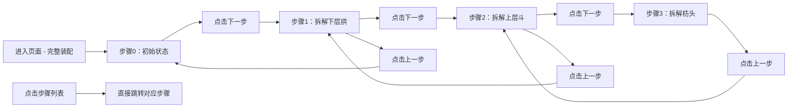

## 1. 产品概述

斗拱拆解三维演示系统，面向古建修缮培训场景，将传统平面示意图转化为可交互的三维步进演示。通过直观的 3D 模型拆解动画，帮助学员理解斗拱构件的装配与拆解顺序。

- 核心目标：以三维可视化方式教授斗拱拆解工艺流程，提升教学直观性
- 目标用户：古建修缮工匠、文物保护专业学员、传统建筑研究人员

## 2. 核心功能

### 2.1 用户角色

| 角色 | 注册方式 | 核心权限 |
|------|----------|----------|
| 培训学员/讲师 | 无需注册，直接访问 | 查看三维模型、控制拆解步进、自由旋转观察 |

### 2.2 功能模块

1. **三维场景主视图**：斗拱 3D 模型展示区，支持 Orbit 相机交互
2. **左侧步骤导航栏**：3 步拆解流程列表，实时高亮当前步骤
3. **右侧说明面板**：当前步骤的中文工艺说明
4. **底部控制栏**：上一步/下一步按钮，步骤进度指示

### 2.3 页面详情

| 页面名称 | 模块名称 | 功能描述 |
|----------|----------|----------|
| 主演示页 | 三维场景 | Three.js 渲染斗拱模型，支持拖拽旋转、滚轮缩放、双击重置相机 |
| 主演示页 | 步骤列表 | 3 步拆解流程（拱→斗→枋），点击可跳转，当前步高亮 |
| 主演示页 | 说明侧栏 | 展示当前步骤的工艺说明文字，内置 3 条文案 |
| 主演示页 | 导航控制 | 上一步/下一步按钮，根据边界状态禁用，支持键盘方向键 |

## 3. 核心流程

用户进入页面后看到完整装配的斗拱模型，通过「下一步」按钮按顺序依次拆解构件，每一步对应一个高亮步骤条目和中文说明；可随时通过「上一步」逆序恢复，也可点击步骤列表直接跳转。

## 4. 用户界面设计

### 4.1 设计风格

- **主色调**：深棕木色 (#5D4037) 作为底色，搭配暖金色 (#D4A574) 高亮，体现古建筑木质质感
- **辅助色**：象牙白 (#F5E6D3) 文字，深灰 (#2C1810) 背景
- **按钮风格**：圆角矩形，木质纹理质感，悬停有轻微浮起效果
- **字体**：标题使用「思源宋体」凸显传统韵味，正文使用「思源黑体」保证可读性
- **布局风格**：三栏布局（左侧步骤列表 + 中间三维场景 + 右侧说明面板），底部控制栏悬浮

### 4.2 页面设计总览

| 页面名称 | 模块名称 | UI 元素 |
|----------|----------|---------|
| 主演示页 | 三维场景 | 全屏 WebGL 画布，网格地面，柔和三点光照，木质 PBR 材质 |
| 主演示页 | 步骤列表 | 竖向时间线，当前步骤金色圆点 + 放大动画，已完成步骤灰色勾号 |
| 主演示页 | 说明侧栏 | 半透明白色卡片，标题大字加粗，正文行高 1.8，优雅过渡动画 |
| 主演示页 | 控制栏 | 左右箭头按钮，当前步骤 / 总步骤 进度显示，禁用态灰化 |

### 4.3 响应式设计

- 桌面端优先（≥1280px）：三栏完整布局
- 平板端（768-1279px）：说明面板折叠为可展开抽屉
- 移动端（<768px）：步骤列表改为顶部横向 Tab，说明面板底部弹出

### 4.4 3D 场景指引

- **环境**：柔和室内光环境，HDR 采用温暖博物馆色调，营造展厅氛围
- **光照设置**：主光 Key Light（45° 上方暖光）+ 补光 Fill Light（冷色柔化阴影）+ 轮廓光 Rim Light（背面勾勒边缘）
- **相机设置**：初始距离 8 单位，俯角 30°，OrbitControls 限制极角 10°-85°，目标点锁定斗拱中心
- **镜头运动**：步骤切换时相机平滑过渡到最佳观察角度，每步有预设视角
- **交互与动画**：构件拆解使用 0.6s 缓动动画（easeInOutCubic），沿预设方向分离并伴随轻微淡出
- **后期处理**：轻微抗锯齿 (MSAA 4x)，环境光遮蔽 (AO) 增强立体感，不加 Bloom 保持清晰
- **资产与性能**：所有几何体程序化生成（BoxGeometry 组合），面数控制在 5k 以内，目标帧率 60fps
